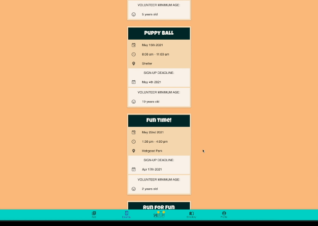
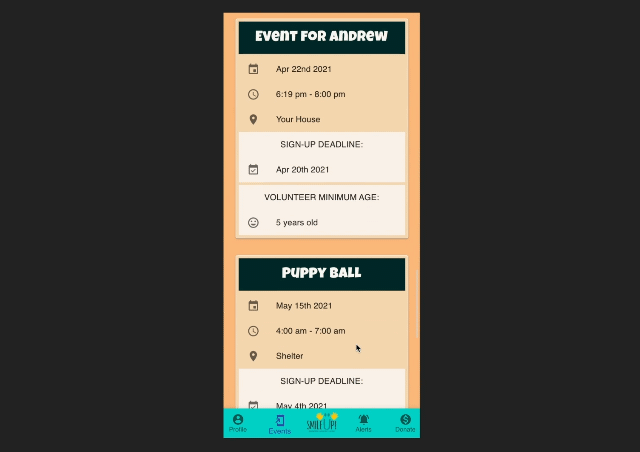
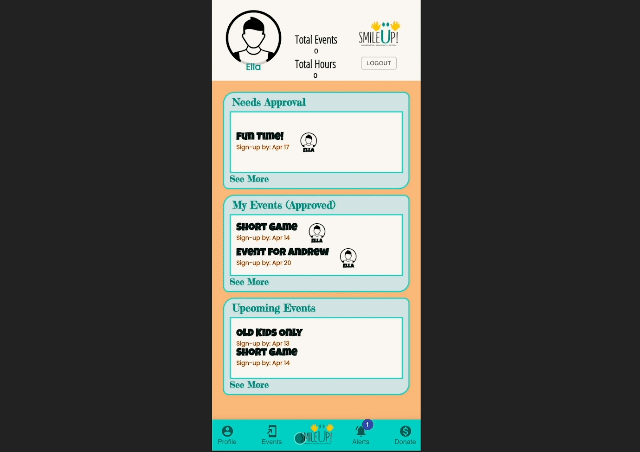
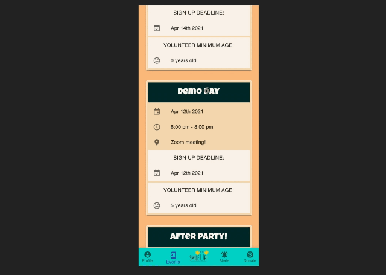
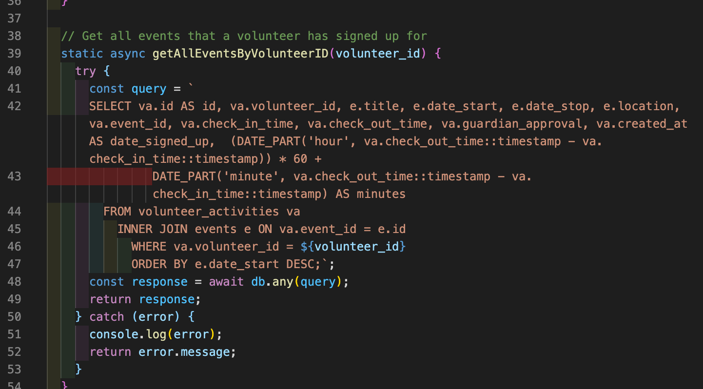
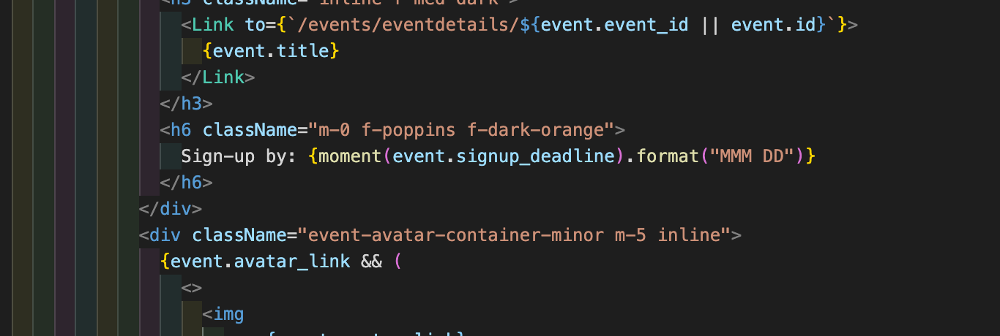
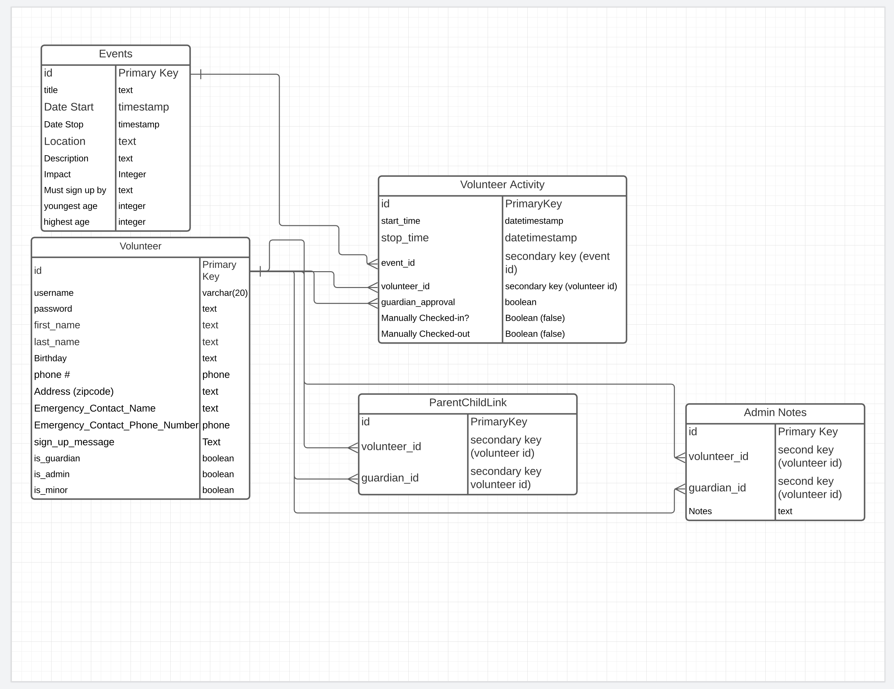

# SmileUp

## Purpose

This app was designed specifically for the Smile Up Charitable Foundation to be the primary member-tracking-system for its growing pool of volunteers. Smile Up envisions a world where young people are leading the charge in volunteerism through awareness, advocacy and action. The SmileUp app provides a safe and secure system for tracking volunteers and events. The app also improves efficiency of tracking various volunteer data, which was previously entered by hand by the nonprofit administrator.

## Who is the app for?

The SmileUp app was built around the three primary user types: administrators, volunteers, and guardians. As a result of SmileUp’s mission to encourage children under the age of 18 to volunteer, nearly all of the volunteers are minors.

## Features

### Admin Account Features

- Ability to create events
- Ability to browse and update event details
- A volunteer directory
- A dashboard to view nonprofit performance
- Ability to upload documents to be accessed globally by guardians and volunteers

### Volunteer Account Features

- Ability to browse volunteer events
- Ability to request volunteer approval from their guardian for specific events
- Ability to track approval requests
- A profile page

### Guardian Account Features

- Ability to approve or decline volunteer requests made by minors
- Ability to edit personal or minor profiles
- Ability to recommend volunteer events for minors

### Other Features

- Secure sign-up page
- Secure login/logout
- Ability to upload a profile picture

## Technologies

### Quick Facts: SmileUp is...

- a full-stack, CRUD web app
- a member-tracking-system
- built on a PERN Stack: Postgres, Express, React, Node.js

### Backend Technologies

- Node.js
- PostgreSQL
- express.js
- bcryptjs: node dependency to secure passwords with salting and hashing
- cors: node dependency to manage cors requirements
- dotenv: node dependency for security of environment variables
- express-session: node dependency to manage login sessions
- pg-promise: allows models to interact with Postgres database
- ElephantSQL: remote Postgres hosting service
- Google Firebase - Storage: cloud storage of documents and profile pictures
- Model & Controller integration to create a custom RESTful Web API (JSON)
- Deployed on Heroku

### Frontend Technologies

- React, with all functional components to manage state and API calls
- Controlled form inputs with state
- React Router
- Styled with material-ui, styled components, and vanilla CSS
- moment (date and timestamp handling)
- Deployed on netlify

### Development Technologies

- create-react-app: quickly launches a react dev environment
- Trello: collaborative Kanban board.
- Postico: database management
- nodemon: real-time server updater
- Git & GitHub: version control
- Slack: ...lots of Slack
- Google Docs: collaborative video scripting, and README word processor
- Justinmind: ux/ui creation; presentation of initial mockups to client
- Lucid: database whiteboarding

## Stretch Goals

- Give guardians the ability to recommend volunteer events to their minors, giving the volunteers more control over their service endeavors
- Think of new ways to incentivize volunteers under the age of 18 to use the app, and thus become more involved in their communities
- Allow volunteers under the age of 18 to submit ideas for new volunteer events.
- Include a social component, allowing guardians to share and comment on events with other guardians.
- Ability for guardians to check in volunteers at each event, with location-based alerts.
- Finally, the ultimate stretch goal will be to recreate the SmileUp app in React Native, making the app fully mobile and more accessible.

## Development Team

- [Josh Garner](https://mrjgarner.com/) ([GitHub](https://github.com/jg-2021)): styling, logo design
- [Andrew Martins](https://www.linkedin.com/in/andrew-martins-jr/) ([GitHub](https://github.com/martins309)): frontend logic, backend logic, styling, logo design
- [Crystal Atkinson](https://www.linkedin.com/in/crystal-atkinson/) ([GitHub](https://github.com/crystalatk)): Project Manager, vision caster, frontend logic, backend logic, styling
- [John Manack](https://www.linkedin.com/in/john-manack/) ([GitHub](https://github.com/john-manack)): Technical Writer, frontend logic, backend logic

## Helpful Links

- [Deployed Site](https://smileup.netlify.app/)
- [Frontend Repository](https://github.com/crystalatk/smile_up)
- [Backend Repository](https://github.com/crystalatk/smileUp_back)
- [Smile Up Foundation Main Website](http://www.smileupfoundation.org/)
